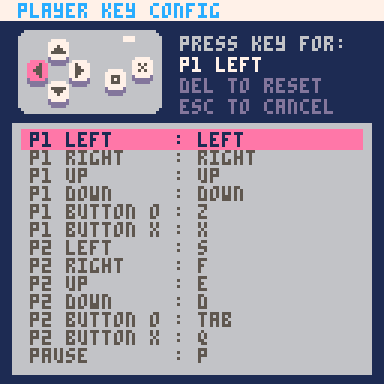
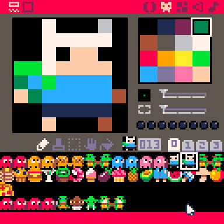
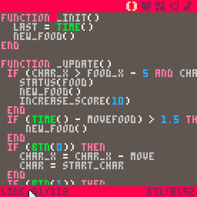

# BOSS Presentation

## About Presentation

The following materials are for use in the [Pico-8](http://www.lexaloffle.com/pico-8.php) workshop at [Big Orange Stem Saturday](https://www.lib.utk.edu/outreach/soil/b-o-s-s/) on April 8, 2017.

## About Pico-8

[PICO-8](http://www.lexaloffle.com/pico-8.php) is a fantasy console for making, sharing and playing tiny games and other computer programs. When you turn it on, the machine greets you with a shell for typing in Lua commands and provides simple built-in tools for creating your own cartridges.

Some technical specifications:

* The display is 128 x 128 pixels
* The display supports 16 colors
	* 
* Can support 128 8x8 sprites ber game
* Controller support for 2 players:
	* A D-Pad (Up + Down + Left + Right)
	* 2 buttons (A + B)
	* A Pause Button
	* 

## Other Helpful Links

* [Pico-8 Zines](http://pico8fanzine.bigcartel.com/): Pico-8 zines are awesome 48-page fanzines made by and for PICO-8 users.
* [Pico Awesome List](https://github.com/felipebueno/awesome-PICO-8): A curated list of awesome PICO-8 resources, carts, tools, and more.
* [A Pico-8 Space Shooter in 16 Gifs](https://ztiromoritz.github.io/pico-8-shooter/): Learn how to write a spaceshooter in Pico-8 in 16 gifs.
* [Pico-8 Cheat Sheet](https://ztiromoritz.github.io/pico-8-spick/index_en.html): Awesome Cheat sheet for Pico-8.

## Starting Up Pico-8

## The Sprite Editor



The sprite editor is where you create your graphics.

Sprites are computer graphics that may be moved on-screen and otherwise manipulated as a single entity.

Once your pico editor is running, you can click the second icon in from the left on the upper-right-hand side of the screen.

If you click the sprite, you can see its number.  In the example, Finn is number **13**.

**To do**:
* **Pick a character on line 1**, and write down its corresponding number.  Note:  each character has 2 sprites.  You want to write down the number of the sprite on the left.
* **Pick a food on line 2**, and write down its corresponding number.


## The Code Editor

This is where we will write all the code that defines our game.

While it can be hard to read due to the 128 x 128 screen size, the code editor is nice because it helps you spot errors in your code by supporting syntax highlighting.



## One:  Variables

Let's get started.

The first thing we want to do is write down variables and values that we'll use in our game.

**Variables** are the first programming concept we will discuss.  Variables have a name and associated value.  While the name stays the same, the value can change.

To get started, let's write some code to represent the hero of our game.  In your code editor, write a variable called start_hero and set it equal to the number you wrote down.  We will also write down a variable called hero, and set it equal to our variable start_hero.  In our game, the hero variable will be used to represent which of the 2 sprites to display. Finally, write a variable called food and set it equal to the other number you wrote down.

We also need variables for where we will display our sprites on the screen.  Remember, the display is 128 x 128 pixels. Let's write variables to put our food in the upper-left corner of the screen, and our hero lower and to the right.

##### Our New Code Should Look Like:
```
start_hero = 12
hero = start_hero
food = 16
food_x = 20
food_y = 20
hero_x = 80
hero_y = 80
```

## Two: Functions and Special Function _init()

In programming, a **function** is a block of code that performs a specific task when its called. Functions are important because they all you to repeat the same tasks without having to write all the instructions over again.

We will write and call several functions throughout the course of our game.

In Pico8, there are 3 special functions that are called **automatically** if defined by the user.  The first is _init().  _init() is called once on program start up.

Let's write an _init() function.  Inside of the function, we will **call** a function that is already defined by Pico8 called cls().  cls() is useful because it clears the screen every time it's called.  Once we've written this code, our game will clear the screen each time the game starts.

##### Our New Code Should Look Like:
```
function _init()
  cls()
end
```

## Three: Functions and Special Function _draw()

##### Our New Code Should Look Like:
```
function _draw()
  cls()
  spr(food, food_x, food_y)
  spr(hero, hero_x, hero_y)
end
```

## Four-- Special Function _update and Conditionals

##### Our New Code Should Look Like:
```
function _update()
	if (btn(0)) then
			char_x = char_x - move
	end
	if (btn(1)) then
			char_x = char_x + move
	end
	if (btn(2)) then
			char_y = char_y - move
	end
	if (btn(3)) then
		 char_y = char_y + move
	end
end
```